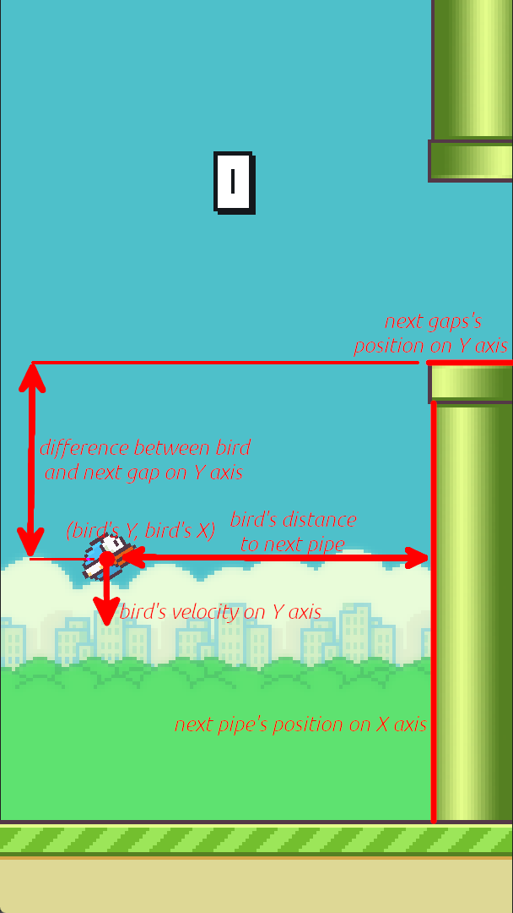

# Flappy bird - FFNN with GA 
## Opis projektu
Projekt przedstawia wizualizację procesu uczenia sieci neuronowej sterującej grą Flappy Bird przy użyciu algorytmu genetycznego. Algorytm genetyczny optymalizuje sieć neuronową, aby umożliwić postaci w grze (ptakowi) przetrwanie jak najdłużej, omijając przeszkody.

## Funkcjonalności
- Wizualizacja przebiegu uczenia się AI w czasie rzeczywistym.
- Możliwość konfigurowania algorytmu generycznego i optymalizowanej sieci neuronowej

## Konfiguracje
Podczas ekranu początkowego aplikacji użytkownik ma możliwość wybrania architektury sieci tzn. jakie wejścia dostaje sieć i ilość ukrytych neuronów. Może również zmienić parametry algorytmu genetycznego: włączyć lub wyłączyć elityzm, zmienić rozmiar populacji oraz prawdopodobieństwo zajścia mutacji i krzyżowania.

# Możliwe wejścia sieci
<p align="center">

</p>

## Technologie
 - Python: Główny język programowania.
 - Pygame: Wizualizacja gry Flappy Bird i sieci neuronowej
 - NumPy: Operacje matematyczne i manipulacja danymi.
 - PyImgui: Implementacja interfejsu uzytkownika

## Jak uruchomić 
```Shell
$ pip install pygame imgui[pygame] numpy PyOpenGL
$ python ./main.py
```
